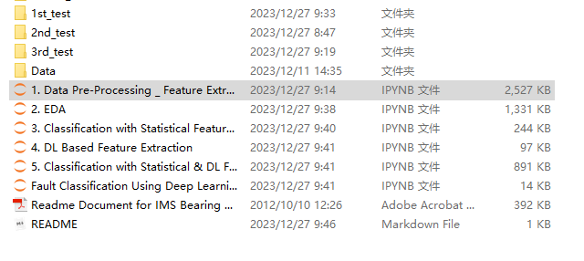
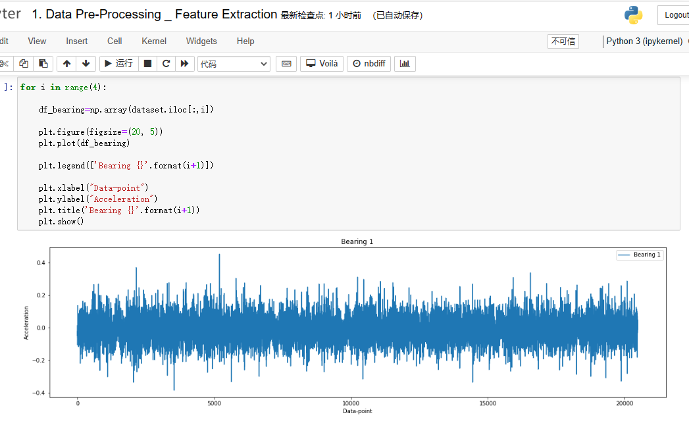
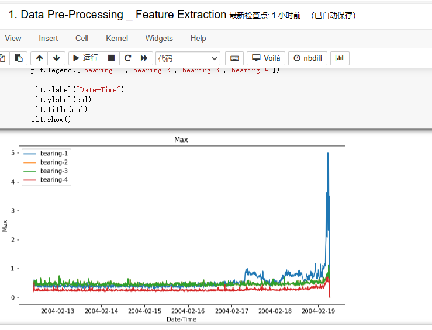
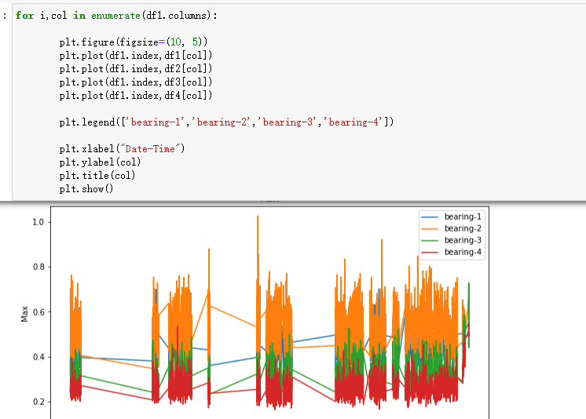
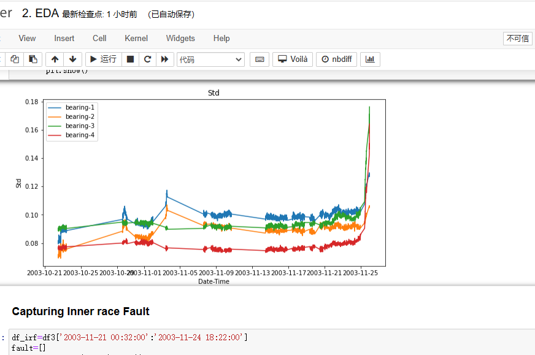
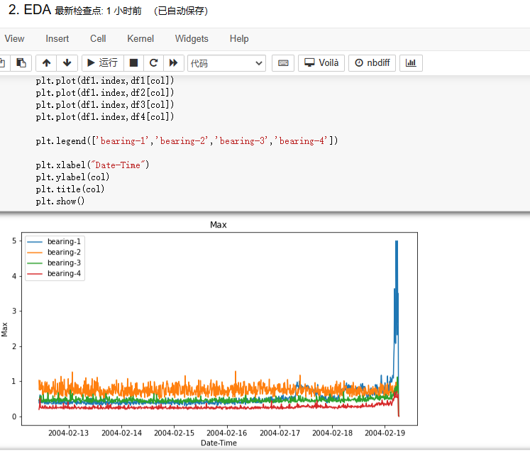
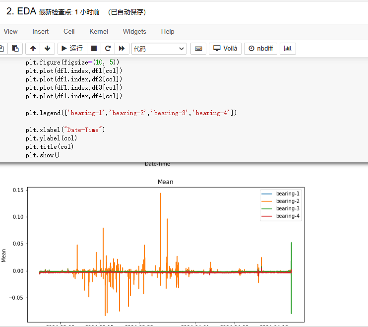

# Python Environment for Rolling Bear State Monitoring and Fault Diagnosis (NASA IMS Bearing Fault Dataset)

The algorithm runs in a Jupyter Notebook environment.
(Download the IMS bearing fault dataset from the Readme file)
```python
import matplotlib.pyplot as plt
import numpy as np
import pandas as pd
import seaborn as sns
from sklearn.neural_network import MLPClassifier
from sklearn.neighbors import KNeighborsClassifier
from sklearn.svm import SVC
from sklearn.gaussian_process import GaussianProcessClassifier
from sklearn.gaussian_process.kernels import RBF
from sklearn.tree import DecisionTreeClassifier
from sklearn.ensemble import RandomForestClassifier, AdaBoostClassifier
from sklearn.naive_bayes import GaussianNB
from sklearn.discriminant_analysis import QuadraticDiscriminantAnalysis
import plotly.express as px
import plotly.graph_objects as go
import catboost as cb
import lightgbm as lgbm
from sklearn.metrics import precision_score, precision_recall_fscore_support
from sklearn.metrics import recall_score
from sklearn.metrics import f1_score
```

## Images









Here is a pay link on Stripe ( https://buy.stripe.com/3cs8yP7sY87d0vu9AB ). Please contact me lonlonago@foxmail.com after funding $89, and I will send you a complete data files , thank you!


